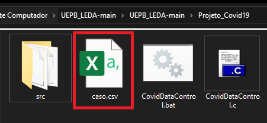

# Análise comparativa de algoritmos de ordenação aplicado a dados da COVID-19

Este Projeto consiste em Analisarmos uma Planilha de dados dos casos da Covid-19 no Brasil e aplicarmos os métodos de ordenação estudados na disciplina de Laboratório de Estrutura de Dados. 

## [*] Como Executar:

1. Para ser Executado corretamente, é necessario que seja instalado uma versão do Java JDK 1.8 ou superior.
 a instalação do JDK pode ser realizada diretamente no [site oficial da Oracle.](https://www.oracle.com/br/java/technologies/javase/javase-jdk8-downloads.html)
 
2. Baixe esse repositório do GitHub em sua máquina [(zip)](https://github.com/allen080/UEPB_LEDA/archive/refs/heads/main.zip).
3. Crie uma conta no site do dataset [https://brasil.io)(https://brasil.io/auth/entrar).
4. Entre na sua conta criada e faça download do dataset em [caso.csv](https://brasil.io/dataset/covid19/caso/?is_last=True&format=csv) **(OBS: o dataset foi previamente filtrado para conter apenas os dados mais recentes (É a ultima atualização? = True).**
5. Renomeie o dataset baixado para **caso.csv**. 
6. Insira o arquivo **caso.csv** na Pasta **UEPB_LEDA-main/Projeto_Covid19/**.
 
9. Com isso, o programa poderá ser executado das seguintes formas:

	- **Atalhos Executavéis:**
		- **Windows:** Dando 2 cliques nos arquivos *CovidDataControl.exe*, *CovidDataControl.bat* ou *CovidDataControl . py (Se possuir o [python](https://www.python.org/downloads) no computador).*
		-  **Linux/OSX:** Executando no terminal na pasta **UEPB_LEDA-main/Projeto_Covid19** com python CovidDataControl. py ou bash CovidDataControl. sh.

	- **Terminal/CMD:**
		- Abrindo o Prompt do seu sistema, indo até o diretorio **UEPB_LEDA-main/Projeto_Covid19/src** e executando o comando: 
			- javac Main.java && java Main
	- **IDE's:**
		- Criando um projeto na IDE de sua preferência (que ofereça suporte a linguagem Java) e atribuindo os arquivos contidos na pasta **UEPB_LEDA-main/Projeto_Covid19/src** ao projeto.
